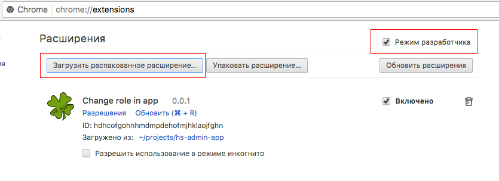
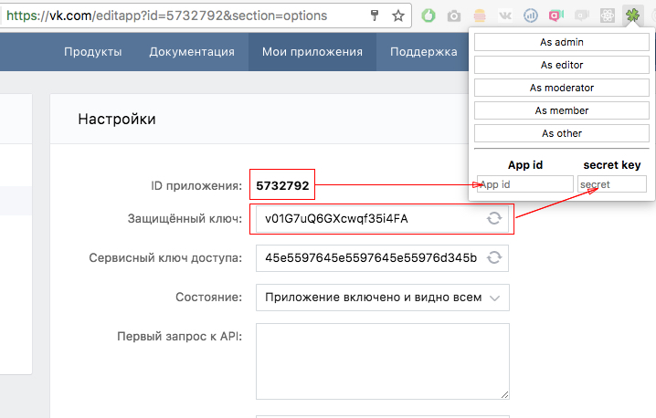
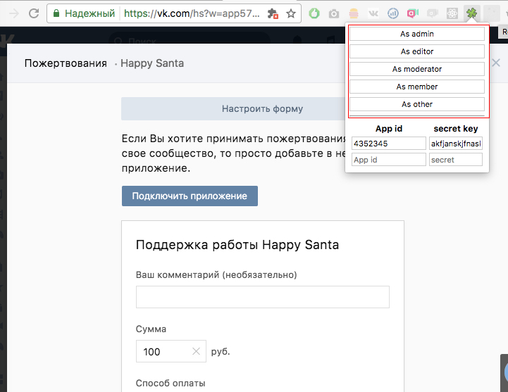

Расширение Google Chrome для изменения роли в приложении
========================================================
Нафига это надо?
----------------

Если вы разрабатываете приложения сообществ для ВКонтакте https://vk.com/dev/community_apps то вам может понадобиться открыть приложение 
как администратор сообщества / модератор / редактор или как пользователь, который не состоит в сообществе.
Выходить из сообщества – долго, но теперь у вас есть это расширение

Как установить
--------------

Установите из стора google chrome [TODO //add link]

или

1 – скачать этот репозиторий

2 – Visit chrome://extensions in your browser (or open up the Chrome menu by clicking the icon to the far right of the Omnibox:  The menu's icon is three horizontal bars. and select Extensions under the Tools menu to get to the same place).

3 - Ensure that the Developer mode checkbox in the top right-hand corner is checked.

4 – Click Load unpacked extension… to pop up a file-selection dialog.

5 – Navigate to the directory in which your extension files live, and select it.

Как пользоваться
----------------

1 – добавить id приложения и его секретный ключ в расширение

2 – на странице с открытым приложением выбоать роль которая вам нужна

